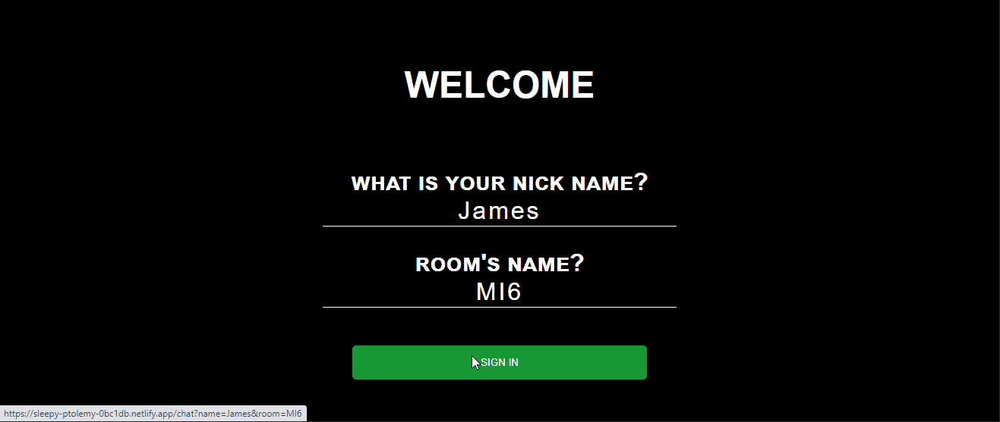
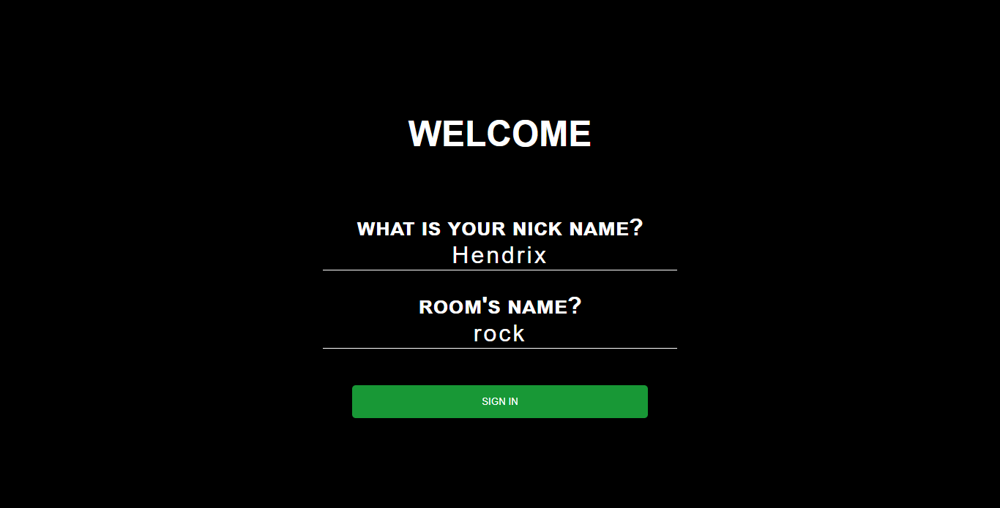
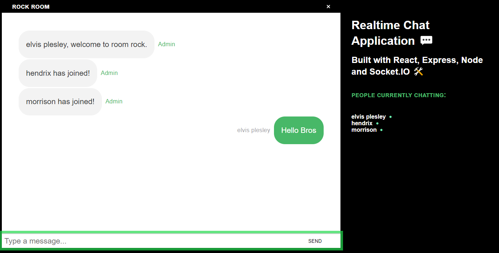
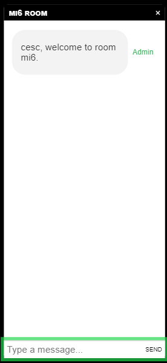

# CHAT APPLICATION 

_This is a practice developing a frontend chat app using React and Socket.io_

## Built with 🛠️

* [React](https://es.reactjs.org/) - A JavaScript library for building user interfaces.   
Libraries:
    * [react-scroll-to-bottom]() 
    * [socket.io-client]()
    * [react-emoji]() 
    * [react-router-dom]() 

## Options

You can use the chat app, just need fill the inputs with a nickname and the rooms name, press sign in.

And now you are join into a room.

## Available Scripts

In the project directory, you can run:

### `yarn start`

Runs the app in the development mode. 
Open [http://localhost:3000](http://localhost:3000) to view it in the browser.

### `yarn test`

Launches the test runner in the interactive watch mode. 
See the section about [running tests](https://facebook.github.io/create-react-app/docs/running-tests) for more information.

### `yarn build`

Builds the app for production to the `build` folder. 
It correctly bundles React in production mode and optimizes the build for the best performance.

The build is minified and the filenames include the hashes. 
Your app is ready to be deployed!

See the section about [deployment](https://facebook.github.io/create-react-app/docs/deployment) for more information.

---
⌨️ with ❤️ by [cesarevc](https://github.com/cesarevc)